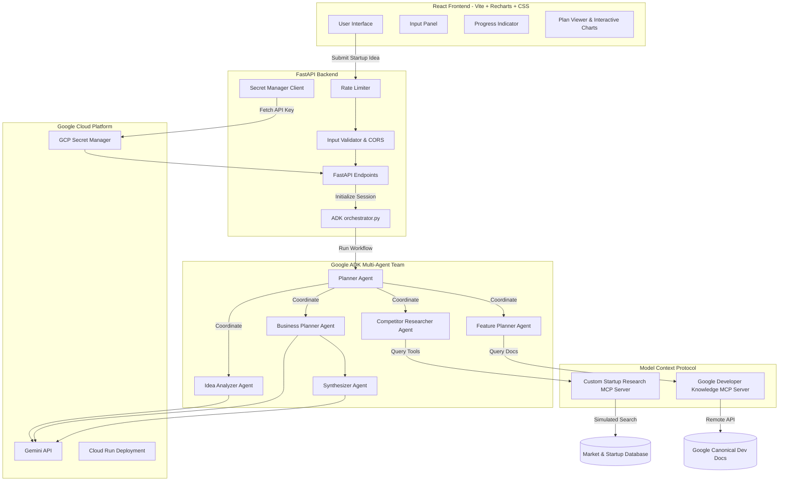

# Startup Studio AI - Multi-Agent Business Planner

Startup Studio AI is an advanced AI-powered application designed to help entrepreneurs transform a raw startup concept into a detailed, refined, and actionable business plan. 

The application utilizes the **Google Agent Development Kit (ADK)** to orchestrate a specialized squad of agents managed by a central coordinating **Planner Agent**. It connects to both a local **Custom Startup Research MCP Server** and a remote **Google Developer Knowledge MCP Server** to run deep competitive analysis and verify architecture guidelines.

---

## 1. Architecture Flow



---

## 2. Project Folder Structure

```
Startup Studio AI/
│
├── backend/
│   ├── agents/
│   │   ├── base_agent.py              # Base caching agent implementation with exponential backoff
│   │   ├── planner_agent.py           # Coordinator agent initializing orchestration milestones
│   │   ├── idea_analyzer.py           # Analyzes refined concept, demographics, and SWOT quadrant details
│   │   ├── competitor_researcher.py   # Discovers market CAGR and competitor matrix profiles via MCP
│   │   ├── feature_planner.py         # Configures tech stack requirements and scopes MVP details
│   │   ├── business_planner.py        # Formulates pricing tiers and Go-To-Market channels
│   │   └── synthesizer_agent.py       # Combines specialized agent reports into final markdown text
│   │
│   ├── Dockerfile                     # Multi-stage container setup for FastAPI
│   ├── main.py                        # FastAPI routes, CORS setups, validation handlers, and rates
│   ├── orchestrator.py                # Google ADK workflow compiled graph DAG and task runners
│   ├── mcp_server.py                  # Local FastMCP Server defining market & competitor search tools
│   ├── google_dev_mcp_client.py       # Client session mapping to Google Developer Knowledge MCP
│   ├── security.py                    # Rate limiting models, GCP Secret Manager, token controls
│   ├── mock_data.py                   # High-fidelity mock structures for local API-keyless execution
│   ├── history.json                   # Local file-based session persistence
│   ├── validate_setup.py              # Local testing/verification execution checklist script
│   └── requirements.txt               # Backend Python dependency catalog
│
├── frontend/
│   ├── src/
│   │   ├── main.jsx                   # React application root mount point
│   │   ├── App.jsx                    # Premium SaaS dashboard, tab managers, and Recharts cards
│   │   └── App.css                    # Styled global sheet containing animations, cards, grids, skeletons
│   │
│   ├── Dockerfile                     # Multi-stage production container setup with Nginx
│   ├── nginx.conf                     # Nginx proxy/reverse configurations
│   ├── package.json                   # React Vite and Recharts package dependencies
│   ├── vite.config.js                 # Local dev server and API proxy setup
│   └── index.html                     # Frontend base layout container HTML
│
├── docker-compose.yml                 # Unified local dev stack composer
└── README.md                          # Current project blueprint documentation
```

---

## 3. Kaggle Capstone Criteria Checklist

| Criteria | Implementation Details | File References |
| :--- | :--- | :--- |
| **ADK Framework** | Configures graph-based workflows and initializes autonomous Pydantic-based agent nodes using the official `google-adk` package. | [`orchestrator.py`](file:///backend/orchestrator.py) <br> [`base_agent.py`](file:///backend/agents/base_agent.py) |
| **Coordinated Agents** | A central `PlannerAgent` orchestrates four specialized sub-agents sequentially to analyze the core idea, competitors, features, and monetizations, aggregating final plans. | [`planner_agent.py`](file:///backend/agents/planner_agent.py) <br> [`idea_analyzer.py`](file:///backend/agents/idea_analyzer.py) |
| **Model Context Protocol (MCP)** | Implements a local Custom FastMCP server for research tools, and links to Google's remote Developer Knowledge MCP for system guides. | [`mcp_server.py`](file:///backend/mcp_server.py) <br> [`google_dev_mcp_client.py`](file:///backend/google_dev_mcp_client.py) |
| **Enterprise Security** | Integrates rate limiting per client, strict CORS lists, header token validation, Pydantic input models, and dynamic Secret Manager API Key resolution. | [`security.py`](file:///backend/security.py) <br> [`main.py`](file:///backend/main.py) |
| **Deployability** | Provides multi-stage, production-ready Dockerfiles for React/Nginx and FastAPI, complete with a root `docker-compose.yml` config. | [`Dockerfile (Backend)`](file:///backend/Dockerfile) <br> [`Dockerfile (Frontend)`](file:///frontend/Dockerfile) <br> [`docker-compose.yml`](file:///docker-compose.yml) |
| **Premium Web UX** | Features a glassmorphism theme, Recharts SVG graphs, skeleton load bars, custom markdown compilation, and focus navigations. | [`App.jsx`](file:///frontend/src/App.jsx) <br> [`App.css`](file:///frontend/src/App.css) |

---

## 4. Multi-Agent Reasoning Workflow

Startup Studio AI uses a sequential DAG workflow to coordinate agents. This ensures structured feedback aggregation at every step:

```
[START]
   │
   ▼
1. PlannerAgent            ──► Evaluates user idea & coordinates planning goals.
   │
   ▼
2. IdeaAnalyzer            ──► Refines the concept, outlines target demographics & SWOT.
   │
   ▼
3. CompetitorResearcher   ──► Queries FastMCP search tools for size, CAGR & competitor lists.
   │
   ▼
4. FeaturePlanner          ──► Consults Google Dev Docs MCP to design core tech stacks & roadmaps.
   │
   ▼
5. BusinessPlanner         ──► Configures pricing tiers, monetization, & GTM models.
   │
   ▼
6. SynthesizerAgent        ──► Aggregates all reports to format a final PDF-ready Markdown layout.
   │
   ▼
[COMPLETE]
```

---

## 5. Model Context Protocol (MCP) Integrations

### Local custom `StartupResearchServer`
Built on FastMCP, this server provides tool endpoints for real-time market intelligence queries:
* `search_competitors(industry: str, idea: str) -> list[dict]`: Locates similar companies from the database matching industry/concept keywords.
* `fetch_market_stats(domain: str) -> dict`: Resolves sector CAGR, valuation in billions, and primary market trends.

### Remote custom Google Developer Knowledge MCP
Routes documentation searches to Google's centralized developer guidance records:
* `search_documents(query: str) -> str`: Fetches security, CORS, and deployment guidelines for FastAPI, React, and Google Cloud Run. Falls back to local canonical guides if offline.

---

## 6. REST API Documentation

### 1. `POST /api/generate-plan`
Submits a startup idea and configuration to compile. Running asynchronous backend tasks return session details.
* **Headers**: `X-Startup-Studio-Token` (Optional access token protection)
* **Payload**:
```json
{
  "idea": "An AI-guided physical therapy posture tracker...",
  "industry": "Healthcare",
  "target_audience": "Remote office workers",
  "monetization": "SaaS Subscription",
  "custom_gemini_key": "mock"
}
```
* **Response (200 OK)**:
```json
{
  "message": "Workflow started successfully in demo mode",
  "session_id": "a1b2c3d4-e5f6-7a8b-9c0d-1e2f3a4b5c6d"
}
```

### 2. `GET /api/plan-status/{session_id}`
Checks the current execution status and retrieves intermediate compiled JSON structures.
* **Response (200 OK)**:
```json
{
  "status": "completed",
  "current_step": "Generation Completed",
  "progress_percent": 100,
  "idea_analysis": { ... },
  "competitor_research": { ... },
  "feature_plan": { ... },
  "business_plan": { ... },
  "final_report": "# Executive Startup Blueprint...",
  "error": null,
  "agent_statuses": { ... }
}
```

### 3. `GET /api/history`
Lists metadata for all completed and active historical sessions sorted by timestamp.
* **Response (200 OK)**:
```json
[
  {
    "session_id": "a1b2...",
    "raw_idea_preview": "An AI-guided physical therapy...",
    "industry": "Healthcare",
    "timestamp": "2026-07-04 18:31:00"
  }
]
```

### 4. `GET /api/health`
Health check endpoint verifying environment readiness.
* **Response (200 OK)**:
```json
{
  "status": "healthy",
  "gemini_api_configured": true
}
```

---

## 7. Local Setup & Installation

### Option A: Using Docker Compose (Recommended)
1. Copy the environment template:
   ```bash
   cp .env.example .env
   ```
2. Open `.env` and fill in your `GEMINI_API_KEY`.
3. Run the container cluster:
   ```bash
   docker compose up --build
   ```
4. Open your browser and navigate to `http://localhost:5173`.

### Option B: Running Manually

#### 1. Start the Backend
1. Navigate to the backend directory:
   ```bash
   cd backend
   ```
2. Create and activate a python virtual environment:
   ```bash
   python -m venv venv
   source venv/Scripts/activate # On Windows: venv\Scripts\activate
   ```
3. Install dependencies:
   ```bash
   pip install -r requirements.txt
   ```
4. Run the FastAPI server:
   ```bash
   python -m backend.main
   ```
   The backend will be available at `http://localhost:8080`.

#### 2. Start the Frontend
1. Navigate to the frontend directory:
   ```bash
   cd frontend
   ```
2. Install npm dependencies:
   ```bash
   npm install
   ```
3. Start the Vite development server:
   ```bash
   npm run dev
   ```
   The application dashboard will be available at `http://localhost:5173`.

---

## 8. Google Cloud Run Production Deployment

To deploy this multi-agent app to production on Google Cloud Run:

### 1. Build and Push Backend Image
```bash
# Enable APIs
gcloud services enable artifactregistry.googleapis.com run.googleapis.com secretmanager.googleapis.com

# Create Artifact Registry Repository
gcloud artifacts repositories create startup-studio-repo --repository-format=docker --location=us-central1

# Build and submit container
gcloud builds submit backend/ --tag us-central1-docker.pkg.dev/[PROJECT_ID]/startup-studio-repo/backend:latest
```

### 2. Configure Secret Manager
```bash
# Create the secret key container
gcloud secrets create GEMINI_API_KEY --replication-policy="automatic"

# Set the API key value
echo -n "YOUR_GEMINI_API_KEY" | gcloud secrets versions add GEMINI_API_KEY --data-file=-
```

### 3. Deploy Backend to Cloud Run
```bash
gcloud run deploy startup-backend \
  --image us-central1-docker.pkg.dev/[PROJECT_ID]/startup-studio-repo/backend:latest \
  --platform managed \
  --region us-central1 \
  --allow-unauthenticated \
  --set-env-vars="GCP_PROJECT=[PROJECT_ID],GEMINI_API_KEY_SECRET_NAME=GEMINI_API_KEY" \
  --update-secrets="GEMINI_API_KEY=GEMINI_API_KEY:latest"
```

### 4. Build and Deploy Frontend Image
```bash
gcloud builds submit frontend/ --tag us-central1-docker.pkg.dev/[PROJECT_ID]/startup-studio-repo/frontend:latest

gcloud run deploy startup-frontend \
  --image us-central1-docker.pkg.dev/[PROJECT_ID]/startup-studio-repo/frontend:latest \
  --platform managed \
  --region us-central1 \
  --allow-unauthenticated
```

---

## License
This project is licensed under the Apache-2.0 License.
